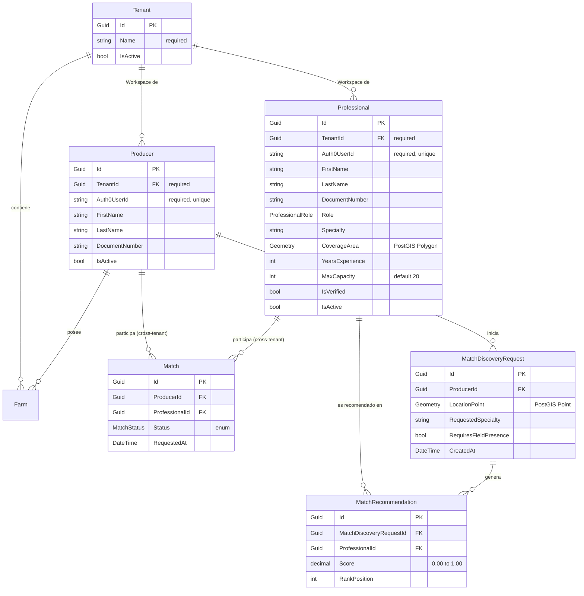

# AgroNexo — Módulo Match Productor ↔ Profesional (v4)

Plan de arquitectura y desarrollo de la API REST para el sistema de matching, incluyendo registro público (Producer/Professional) y motor de recomendaciones geoespacial.

---

## Resumen de Decisiones (Ajustes v4)

| Decisión | Resolución |
|:---|:---|
| **Registro Público y Login de Productor** | Habilitado. Mediante un endpoint público de registro, el usuario elige (toggle) si es Productor o Profesional. Ambos tienen cuenta Auth0 (`Auth0UserId`). |
| **Generación Automática de Tenant** | Al registrarse, el sistema le crea un `Tenant` (espacio de trabajo) propio. Esto cumple con la regla de que todo usuario pertenece a un equipo, que puede arrancar siendo "de una sola persona". |
| **Soporte Cross-Tenant para el Match** | Como un Productor (Tenant A) hace match con un Profesional (Tenant B), la entidad `Match` sirve de puente. El motor de búsqueda (`MatchDiscovery`) y los endpoints de `Match` utilizan `.IgnoreQueryFilters()` de EF Core internamente de forma segura para permitir esta conexión inter-tenant. |
| **Múltiples Profesionales por Especialidad** | **Confirmado:** La base de datos tiene un constraint UNIQUE sobre `(ProducerId, ProfessionalId)`. Esto bloquea que un productor agregue *dos veces al mismo profesional*, pero **permite tener N profesionales distintos de la misma especialidad** (ej. 3 agrónomos distintos). |

---

## Modelo de Dominio

### Diagrama de Entidades

*(Nota: En la entidad `Match` se omite el `TenantId` único, ya que un Match es un vínculo que cruza las fronteras entre el Tenant del Productor y el Tenant del Profesional).*

---

## Motor de Ranking (Application Layer)

El proceso de Discovery (`GenerateMatchRecommendationsUseCase`) funciona en dos etapas determinísticas:

### Etapa 1 — Filtro duro por zona (PostGIS)
El Productor solicita un profesional. La query se ejecuta con `.IgnoreQueryFilters()` para buscar profesionales en toda la plataforma (fuera de su Tenant).
* **Query espacial:** `ST_Contains(professional.coverage_area, discovery_request.location_point)`
* Si la especialidad no requiere presencia física (`RequiresFieldPresence = false`), se salta el filtro geográfico.
* La columna `CoverageArea` lleva un índice espacial **GIST**.

### Etapa 2 — Scoring dentro del set filtrado
Score Compuesto (0 a 1) sumando los siguientes factores:
* **Proximidad (35%)**: `1 - (distancia_km / radio_maximo_km)`
* **Verificación (25%)**: `IsVerified == true ? 1 : 0`. 
* **Especialidad (20%)**: Match exacto `1`.
* **Experiencia (10%)**: `min(YearsExperience / 10, 1)`. 
* **Carga de trabajo (10%)**: `1 - (matches_activos / MaxCapacity)`. (Default MaxCapacity = 20).

---

## Reglas de Negocio Estrictas

1. **Auto-Registro y Tenants:** Cuando un usuario se registra vía `/api/v1/identity/register`, se crea automáticamente un `Tenant` a su nombre (ej. "Workspace de Juan Perez"). 
2. **Constraint de Unicidad en Match (Múltiples especialidades permitidas):** 
   * Se crea un Índice único en la base de datos para la combinación `(ProducerId, ProfessionalId)` con filtro para estados `Pending` o `Active`.
   * Esto permite que el Productor conecte con cualquier cantidad de profesionales (10 agrónomos, 5 contadores), pero bloquea invitaciones duplicadas hacia la misma persona.
3. **Cross-Tenant Authorization en Matches:** Para leer o modificar un `Match`, el usuario autenticado debe ser dueño del `ProducerId` (si es productor) o dueño del `ProfessionalId` (si es profesional).
4. **Soft Delete:** Endpoints de DELETE marcan `IsActive = false`. 

---

## Endpoints de la API

### Identidad y Registro — `/api/v1/identity`
| Método | Ruta | Auth | Descripción |
|:---|:---|:---|:---|
| `POST` | `/api/v1/identity/register` | Require Auth0 Token | Recibe un toggle `UserType` (Producer / Professional). Crea el Tenant, y luego crea la entidad correspondiente asignándole el `Auth0UserId`. |

### Professionals & Producers (Gestión interna)
| Método | Ruta | Policy | Descripción |
|:---|:---|:---|:---|
| `GET` | `/api/v1/professionals/me` | `IsProfessional` | Obtiene el perfil propio. |
| `PUT` | `/api/v1/professionals/me` | `IsProfessional` | Actualiza datos (CoverageArea, MaxCapacity, etc). |
| `GET` | `/api/v1/producers/me` | `IsProducer` | Obtiene el perfil propio. |

### Match Discovery (Iniciado por el Productor) — `/api/v1/match-discovery`
| Método | Ruta | Policy | Descripción |
|:---|:---|:---|:---|
| `POST` | `/api/v1/match-discovery` | `IsProducer` | Genera un pedido, ejecuta PostGIS y el motor de Scoring. |
| `GET` | `/api/v1/match-discovery/{id}/recommendations`| `IsProducer` | Retorna el ranking de profesionales. |

### Matches (El Vínculo Cross-Tenant) — `/api/v1/matches`
| Método | Ruta | Policy | Descripción |
|:---|:---|:---|:---|
| `POST` | `/api/v1/matches` | `Authenticated` | Crea un match (invitación). Retorna 409 si ya existe para ese par. |
| `GET` | `/api/v1/matches` | `Authenticated` | Lista los matches donde el usuario es parte. |
| `PATCH` | `/api/v1/matches/{id}/status` | `Authenticated` | Cambiar estado (Aceptar/Rechazar). |

---

## Plan de Delegación a Subagentes

### Fase 1: Domain Layer + PostGIS Setup
> **Subagente:** Domain Architect
- Integrar `NetTopologySuite`.
- Modelar Entidades con `Auth0UserId` en Producer y Professional.

### Fase 2: Application Layer + Scoring Engine
> **Subagente:** Application Engineer
- Implementar `/identity/register` (creación de Tenant + Entidad).
- Implementar `GenerateMatchRecommendationsUseCase` (Scoring).

### Fase 3: Infrastructure Layer (EF Core + PostGIS)
> **Subagente:** Infrastructure Engineer
- Configurar PostGIS, índices GIST y unique constraints parciales.
- Configurar `IgnoreQueryFilters()` en los repositorios de Búsqueda de Matches.

### Fase 4: API Layer & Auth
> **Subagente:** API Engineer
- Configurar Controllers, Middlewares y Auth0 Claims.
- Implementar policies: `IsProducer`, `IsProfessional`.

### Fase 5: Testing
> **Subagente:** Test Engineer
- Unit tests del Scoring y los pesos.
- Integration tests del constraint de duplicidad de matches y del filtro espacial cross-tenant.
